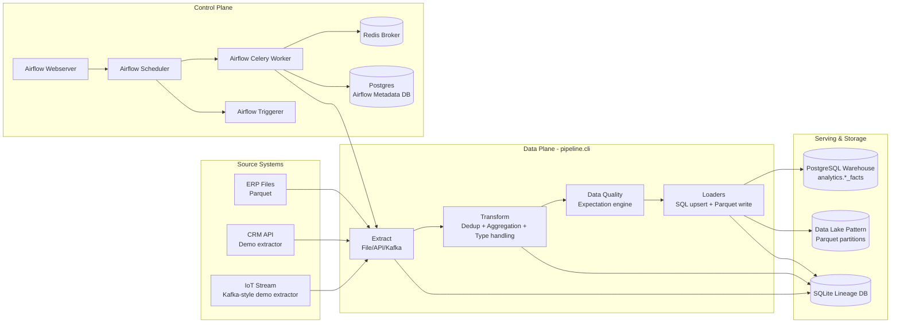

# Enterprise Data Pipeline

Production-style data pipeline template for orchestrating heterogeneous sources (ERP files, CRM API, and IoT/Kafka streams) into analytics-ready datasets with Airflow, PostgreSQL, quality checks, and lineage tracking.

## What Problem This Project Solves

Most data teams start with fragmented ingestion scripts and no consistent operational layer. This project solves that by providing a single, reproducible platform where:

- Different source types are ingested through one configurable pipeline contract.
- Transformations and quality checks are applied consistently before loading.
- Data is delivered to both a warehouse and a data lake pattern.
- Operations are orchestrated and observable through Airflow, structured logs, and lineage events.

## Architecture



## Why The Design Works

- **Separation of concerns**: orchestration, compute logic, and storage are cleanly separated.
- **Config-driven behavior**: source/transform/load behavior is declared in `configs/pipeline.yaml`.
- **Operational resilience**: retries and scheduling are handled by Airflow; SQL upsert path handles repeated runs.
- **Observability by default**: each run emits structured logs and lineage events.
- **Extensibility**: new sources and transformations can be plugged in through factory patterns.

## Technologies Used

### Core Data Engineering

- Python 3.10+
- Pandas + PyArrow
- SQLAlchemy 2.x
- Pydantic + pydantic-settings
- YAML-driven pipeline config

### Orchestration and Runtime

- Apache Airflow 2.8 (CeleryExecutor)
- Celery Worker
- Redis (broker)
- PostgreSQL 15 (metadata + warehouse target)
- Docker Compose

### Data Quality, Logging, and Observability

- Great Expectations-style quality engine (implemented in project)
- Structlog (JSON logs)
- Rich + Typer (CLI UX)
- SQLite lineage store (`data/lineage.db`)

### Engineering Tooling

- Pytest
- Ruff
- Mypy
- GitHub Actions CI scaffold

## Repository Structure

```text
enterprise-data-pipeline/
  configs/                     # Pipeline contract (YAML)
  dags/                        # Airflow DAG definition
  data/                        # Local source samples, datalake output, lineage db
  docs/                        # Architecture notes
  scripts/                     # Bootstrap and sample data generation
  src/pipeline/
    extractors/                # File/API/Kafka extractor implementations
    transformers/              # Transformation pipeline and operators
    quality/                   # Expectation engine
    loaders/                   # SQL and Parquet loaders
    lineage/                   # Lineage tracking backend
    cli.py                     # pipeline CLI entrypoint
  tests/                       # Unit tests
  docker-compose.yml           # Full local stack
```

## Quick Start

### 1. Prerequisites

- Docker + Docker Compose
- Python 3.10+

### 2. Install Dependencies

```bash
pip install -e ".[dev,airflow,kafka]"
```

### 3. Prepare Demo Data

```bash
python scripts/generate_sample_data.py
```

### 4. Start The Stack

```bash
docker compose up -d
```

Airflow UI:

- URL: `http://localhost:8080`
- user: `airflow`
- password: `airflow`

### 5. Run The Pipeline

Option A (inside Airflow):

```bash
docker compose exec -T airflow-webserver airflow dags unpause enterprise_daily_pipeline
docker compose exec -T airflow-webserver airflow dags trigger enterprise_daily_pipeline
```

Option B (direct CLI):

```bash
python -m pipeline.cli run --config configs/pipeline.yaml
```

## Expected Outputs

After a successful run, you should see:

- Warehouse tables in PostgreSQL schema `analytics`:
  - `erp_facts`
  - `crm_facts`
  - `iot_facts`
- Data lake-style Parquet outputs under:
  - `data/datalake/enterprise-datalake-prod/`
- Lineage events persisted in:
  - `data/lineage.db`

Example validation query:

```bash
docker compose exec -T postgres psql -U pipeline -d warehouse -c "SELECT 'analytics.erp_facts' AS table_name, COUNT(*) AS rows FROM analytics.erp_facts;"
```

## Real-World Notes

- This repo is intentionally portfolio-friendly: reproducible, containerized, and easy to demo live.
- CRM and Kafka extractors are currently simulation-based so the platform can run offline and deterministically.
- The architecture is production-oriented; replacing simulated extractors with real connectors is straightforward.

## Portfolio Positioning

If you are presenting this project in interviews, emphasize:

- End-to-end ownership: ingestion, orchestration, quality, loading, and observability.
- Platform thinking: reusable components, configuration-first design, and operational readiness.
- Practical reliability: handling retries, idempotent load behavior, and transparent run diagnostics.

## Author

Jonathan Guida

- GitHub: https://github.com/Jonkred
- LinkedIn: https://linkedin.com/in/jonathan-guida

## License

MIT - see `LICENSE`.
